# 💉 ImuniData — Sistema de Monitoramento de Vacinação

> Sistema Full Stack (Java Spring Boot + React) para consulta e análise de cobertura vacinal por município, estado e tipo de vacina.

---

## 👥 Integrantes do Grupo
| Nome |
|------|
| Lucas Foschini Nilo de Souza |
| Gabriel Pardo de Sena |

---

## 🎯 Objetivo

Transformar dados brutos de vacinação em uma ferramenta de apoio à tomada de decisão para secretarias de saúde e unidades de pronto atendimento. O sistema permite:

- Visualizar o histórico completo de vacinações
- Filtrar por tipo de vacina e estado (UF)
- Cadastrar, editar e excluir registros
- Analisar totais por região e por imunobiológico

---

## 🏗️ Arquitetura

```
Browser (React) ↔ Controller ↔ Service ↔ Repository ↔ H2 Database
```

```
imunidata/
├── imunidata-backend/          # Java 17 + Spring Boot 3
│   ├── pom.xml
│   └── src/main/
│       ├── java/com/imunidata/
│       │   ├── ImuniDataApplication.java
│       │   ├── model/
│       │   │   └── RegistroVacinacao.java   ← @Entity
│       │   ├── repository/
│       │   │   └── RegistroVacinacaoRepository.java  ← JpaRepository
│       │   ├── service/
│       │   │   └── RegistroVacinacaoService.java     ← @Service + CSV
│       │   └── controller/
│       │       └── RegistroVacinacaoController.java  ← @RestController
│       └── resources/
│           ├── application.properties
│           └── dados_vacinacao.csv
│
└── imunidata-frontend/         # React 18 + Vite
    ├── package.json
    ├── vite.config.js
    └── src/
        ├── main.jsx
        ├── App.jsx              ← Dashboard principal
        ├── services/
        │   └── api.js           ← Axios
        └── components/
            ├── VacinacaoTable.jsx
            ├── VacinacaoForm.jsx
            └── Filtros.jsx
```

---

## 📦 Dicionário de Dados

### Entidade: `RegistroVacinacao`

| Campo | Tipo Java | Tipo SQL | Descrição | Exemplo |
|-------|-----------|----------|-----------|---------|
| `id` | `Long` | BIGINT (PK) | Identificador único auto-gerado | 1 |
| `municipio` | `String` | VARCHAR | Município onde ocorreu a vacinação | São Paulo |
| `estado` | `String` | CHAR(2) | Sigla da UF | SP |
| `vacina` | `String` | VARCHAR | Tipo de imunobiológico | BCG, Gripe, Polio |
| `dose` | `String` | VARCHAR | Número da dose aplicada | 1ª Dose, Reforço |
| `quantidadeAplicada` | `Integer` | INTEGER | Quantidade de doses neste registro | 1520 |
| `dataRegistro` | `LocalDate` | DATE | Data de registro da vacinação | 2024-01-10 |

---

## 🛣️ Tabela de Rotas (Endpoints)

| Método | Endpoint | Descrição | Status de Retorno |
|--------|----------|-----------|-------------------|
| `GET` | `/api/vacinacao` | Lista todos os registros | 200 OK |
| `GET` | `/api/vacinacao?vacina=BCG&estado=SP` | Lista com filtros opcionais | 200 OK |
| `GET` | `/api/vacinacao/{id}` | Busca registro por ID | 200 OK / 404 Not Found |
| `POST` | `/api/vacinacao` | Cadastra novo registro | 201 Created / 400 Bad Request |
| `PUT` | `/api/vacinacao/{id}` | Atualiza registro existente | 200 OK / 404 Not Found |
| `DELETE` | `/api/vacinacao/{id}` | Exclui registro por ID | 204 No Content / 404 Not Found |
| `GET` | `/api/vacinacao/por-vacina/{vacina}` | Filtra por tipo de vacina | 200 OK |
| `GET` | `/api/vacinacao/por-estado/{estado}` | Filtra por estado (UF) | 200 OK |
| `GET` | `/api/vacinacao/resumo/por-estado` | Total de doses por estado | 200 OK |
| `GET` | `/api/vacinacao/resumo/por-vacina` | Total de doses por vacina | 200 OK |

---

## 📝 Exemplos de JSON

### POST /api/vacinacao — Corpo da requisição
```json
{
  "municipio": "São Paulo",
  "estado": "SP",
  "vacina": "Gripe",
  "dose": "1ª Dose",
  "quantidadeAplicada": 2500,
  "dataRegistro": "2024-03-15"
}
```

### Resposta 201 Created
```json
{
  "id": 32,
  "municipio": "São Paulo",
  "estado": "SP",
  "vacina": "Gripe",
  "dose": "1ª Dose",
  "quantidadeAplicada": 2500,
  "dataRegistro": "2024-03-15"
}
```

### Resposta 404 Not Found (ID inexistente)
```json
{
  "erro": "Registro não encontrado com ID: 999"
}
```

### GET /api/vacinacao/resumo/por-estado — Resposta
```json
{
  "MG": 4960,
  "RJ": 7300,
  "SP": 8630,
  "BA": 5700
}
```

---

## ⚙️ Guia de Execução

### Pré-requisitos
- Java 17+
- Maven 3.8+ (ou usar o wrapper `mvnw`)
- Node.js 18+

### 1. Backend (Spring Boot)

```bash
# Entre na pasta do backend
cd imunidata-backend

# Compile e execute com Maven
./mvnw spring-boot:run

# Ou no Windows:
mvnw.cmd spring-boot:run
```

A API estará disponível em: **http://localhost:8080**

> ✅ O banco H2 é populado automaticamente ao iniciar, lendo o arquivo `dados_vacinacao.csv`.

### 2. H2 Console

Acesse no navegador: **http://localhost:8080/h2-console**

| Campo | Valor |
|-------|-------|
| JDBC URL | `jdbc:h2:mem:imunidata` |
| Username | `sa` |
| Password | *(vazio)* |

Para conferir os dados:
```sql
SELECT * FROM REGISTRO_VACINACAO;
SELECT ESTADO, SUM(QUANTIDADE_APLICADA) FROM REGISTRO_VACINACAO GROUP BY ESTADO;
```

### 3. Frontend (React)

```bash
# Entre na pasta do frontend
cd imunidata-frontend

# Instale as dependências
npm install

# Execute em modo de desenvolvimento
npm run dev
```

O frontend estará em: **http://localhost:5173**

---

## 💡 Justificativa Técnica: Por que usar `Optional`?

O `Optional` é utilizado no `RegistroVacinacaoService` para eliminar riscos de `NullPointerException` ao buscar registros por ID.

**Sem Optional (problemático):**
```java
// Se o ID não existir, .get() lança exceção genérica e inesperada
RegistroVacinacao r = repository.findById(id).get();
```

**Com Optional (seguro):**
```java
// Forçamos o tratamento explícito da ausência de dados
return service.buscarPorId(id)
    .map(r -> ResponseEntity.ok(r))
    .orElse(ResponseEntity.notFound().build());  // 404 semântico
```

O `Optional` torna o "dado pode não existir" parte explícita da assinatura do método, não um acidente de execução.

---

## 📊 Dados de Exemplo (CSV)

O arquivo `dados_vacinacao.csv` contém amostras inspiradas em dados reais do **OpenDataSUS**, cobrindo municípios de SP, RJ, MG, BA, RS, PR, PE, AM e CE.

Fonte original: https://opendatasus.saude.gov.br

---

## 🧪 Testando com Postman/Insomnia

Importe a collection ou teste manualmente:

```
# Listar todos
GET http://localhost:8080/api/vacinacao

# Filtrar por vacina
GET http://localhost:8080/api/vacinacao?vacina=BCG

# Filtrar por estado
GET http://localhost:8080/api/vacinacao?estado=SP

# Buscar por ID (inexistente → 404)
GET http://localhost:8080/api/vacinacao/999

# Cadastrar
POST http://localhost:8080/api/vacinacao
Content-Type: application/json
Body: { "municipio": "Campinas", "estado": "SP", "vacina": "BCG", "dose": "1ª Dose", "quantidadeAplicada": 300, "dataRegistro": "2024-05-01" }

# Excluir
DELETE http://localhost:8080/api/vacinacao/1
```

---

## 📸 Capturas de Tela

### 1. Dashboard de Listagem
> Tabela principal com todos os registros de vacinação, contadores no header e botões de ação.

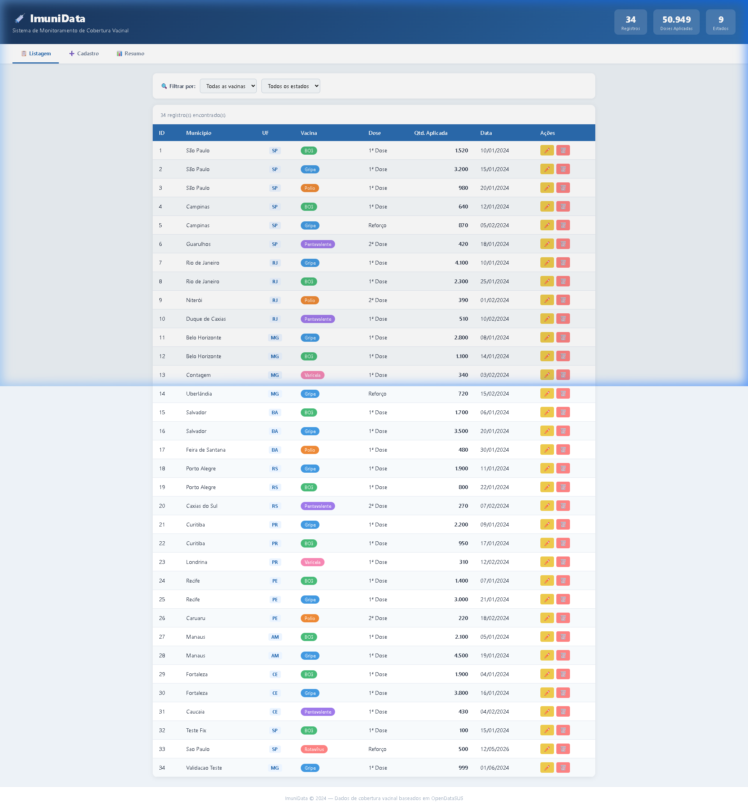

---

### 2. Filtro por Tipo de Vacina
> Campo de busca dinâmico filtrando registros pelo tipo de imunobiológico (ex: BCG) em tempo real via API.

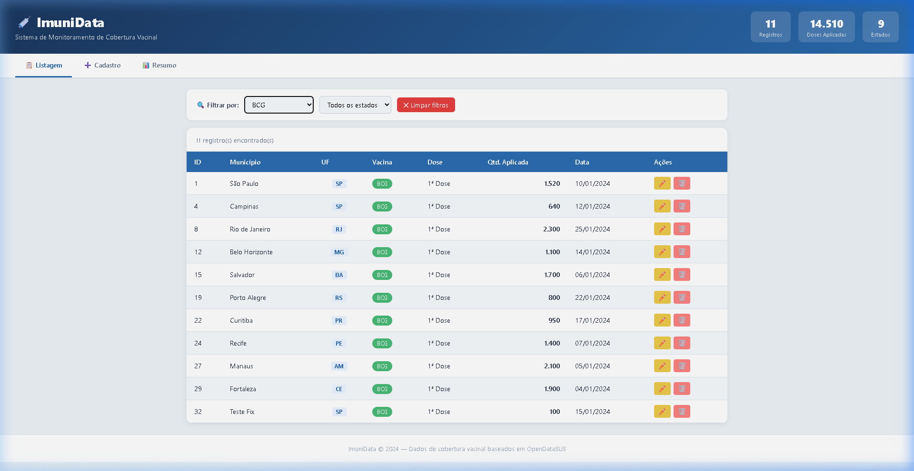

---

### 3. Filtro por Estado (UF)
> Filtro por estado/região mostrando apenas os registros do estado selecionado (ex: SP).

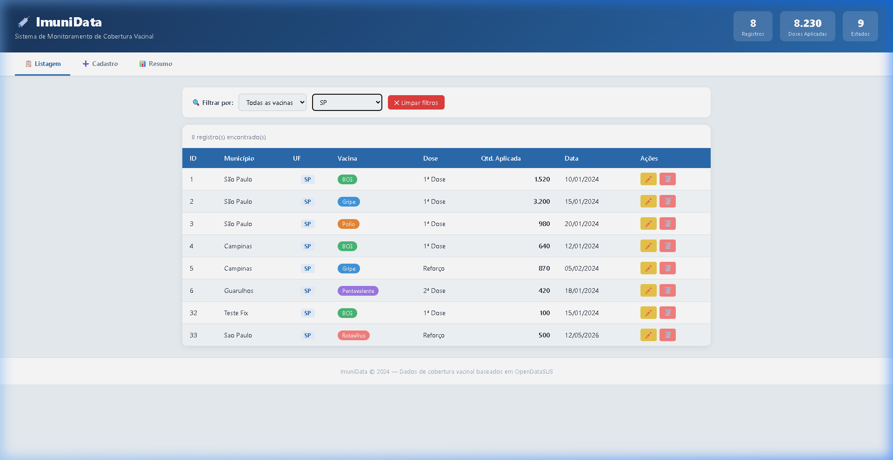

---

### 4. Formulário de Cadastro
> Tela de inserção de nova aplicação de vacina com todos os campos obrigatórios.

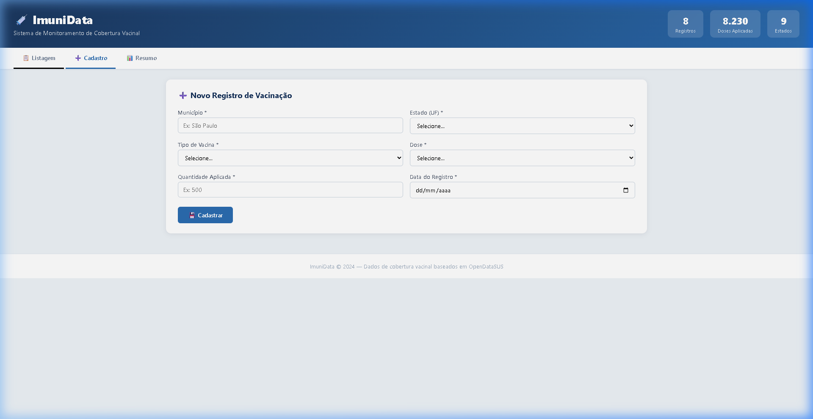

---

### 5. Formulário Preenchido
> Formulário com dados preenchidos antes de enviar para a API (POST /api/vacinacao).


---

### 6. Cadastro Realizado com Sucesso
> Após o cadastro, o sistema retorna para a listagem e o novo registro aparece na tabela (201 Created).

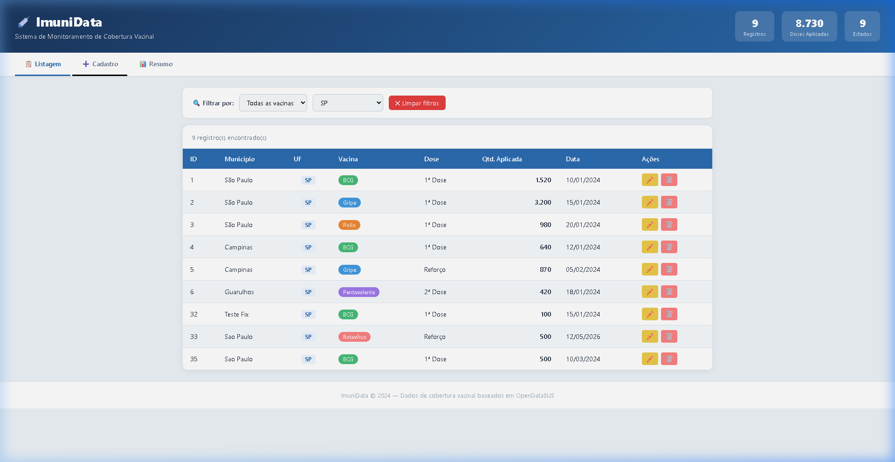

---

### 7. Resumo por Estado e por Vacina
> Dashboard de análise com totais de doses aplicadas agrupados por estado e por tipo de vacina.

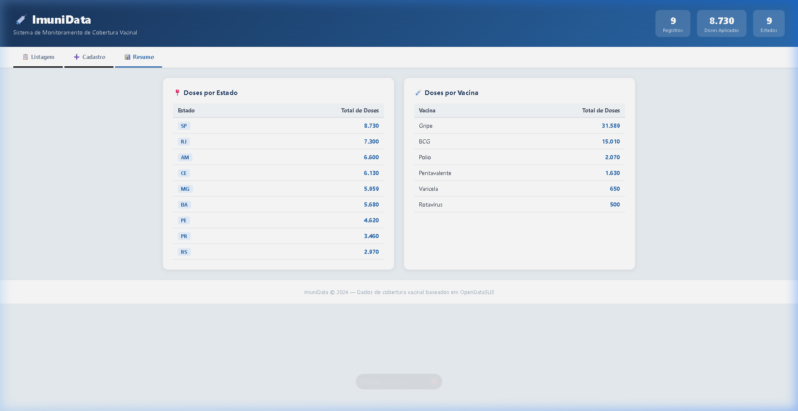

---

## 🔌 Testes da API — Insomnia

### 8. GET /api/vacinacao — Lista todos os registros
> **200 OK** — Retorna array com todos os registros carregados do CSV (4.7 KB).

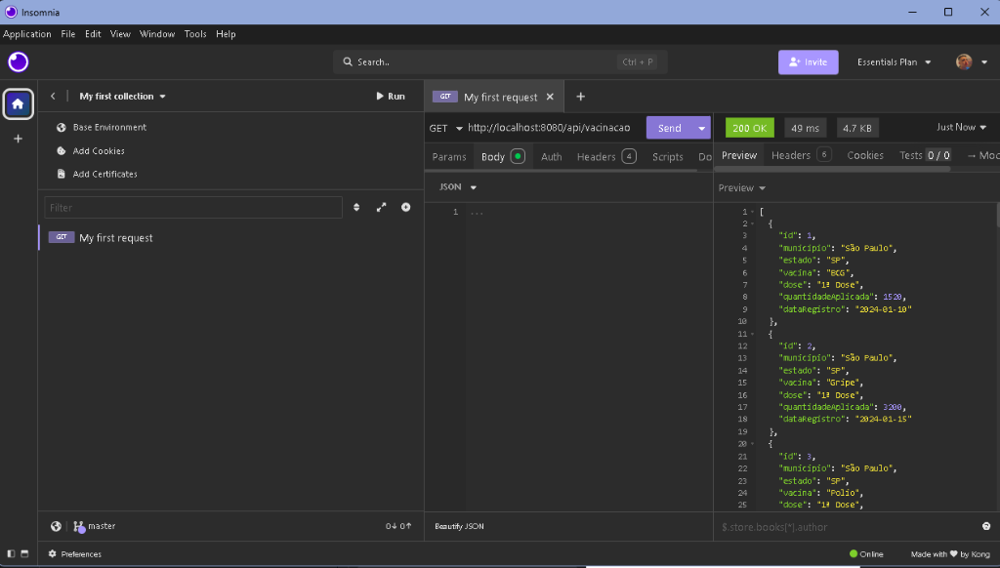

---

### 9. GET /api/vacinacao?vacina=BCG — Filtro por Tipo de Vacina
> **200 OK** — Consulta especializada retornando apenas registros de BCG (1618 B).

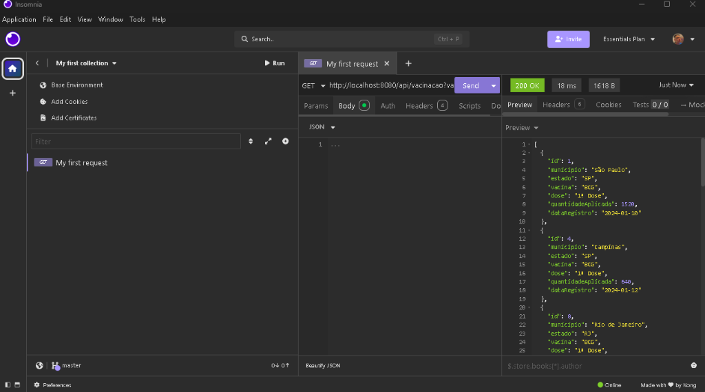

---

### 10. GET /api/vacinacao?estado=SP — Filtro por Estado
> **200 OK** — Consulta especializada retornando apenas registros do estado SP (1226 B).

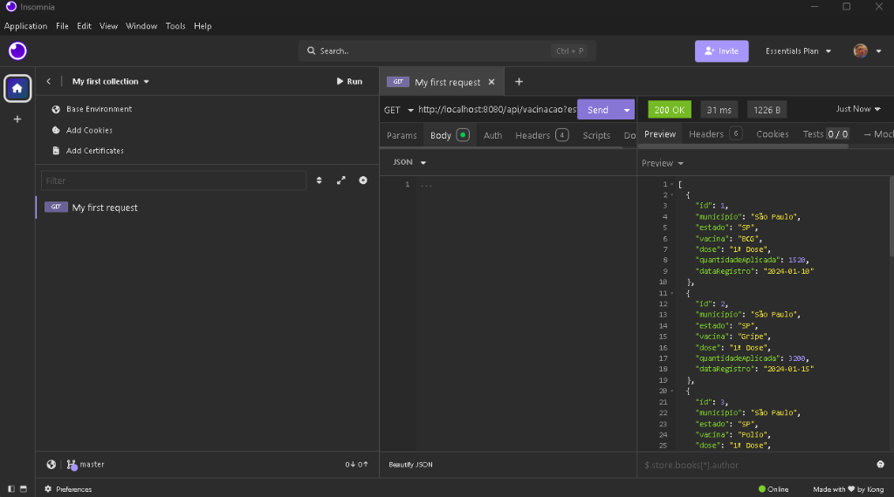

---

### 11. GET /api/vacinacao/1 — Buscar por ID
> **200 OK** — Retorna o registro específico pelo ID (134 B).

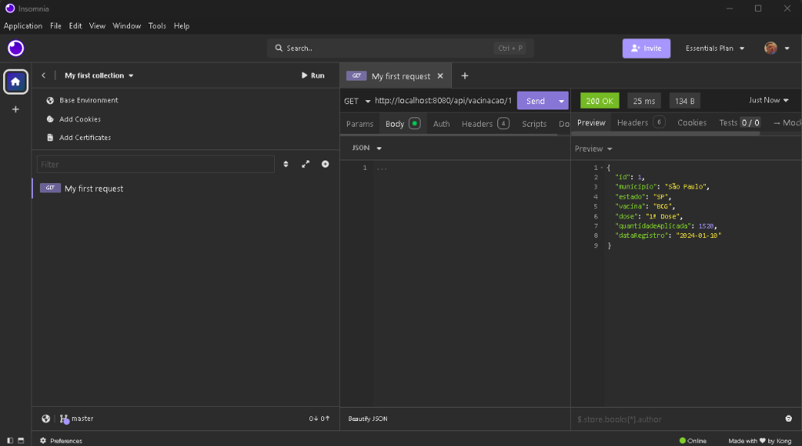

---

### 12. GET /api/vacinacao/999 — Tratamento de Erro 404
> **404 Not Found** — ID inexistente, tratado com `Optional` no Service. Retorno semântico correto.

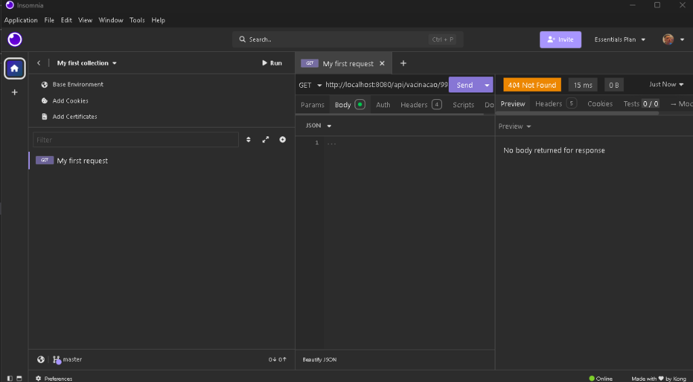

---

### 13. H2 Console — Banco de Dados em Memória
> Consulta SQL direta na tabela `REGISTRO_VACINACAO` mostrando os 5 registros mais recentes, incluindo os cadastrados pelo frontend.

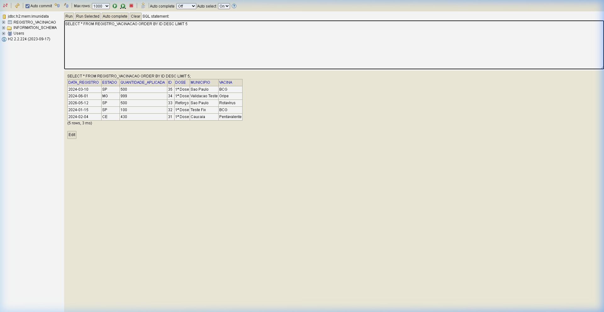
